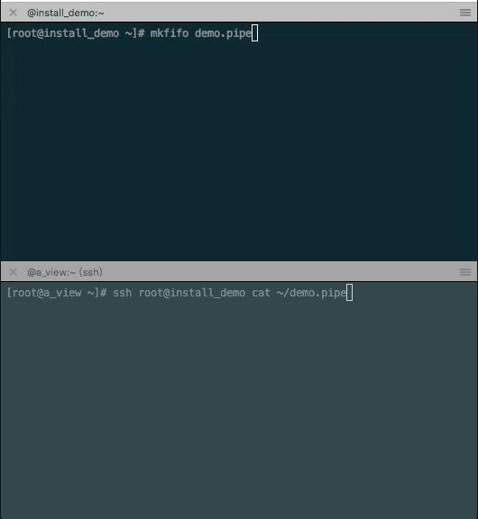
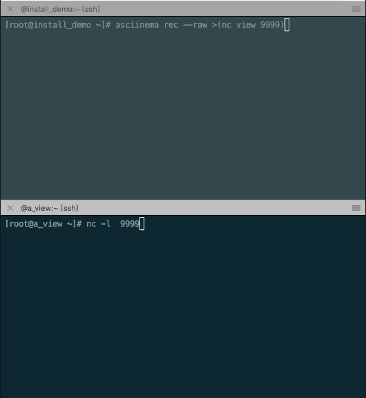

借助asciinema 实现linux系统下的屏幕分享
占坑，待补充

<!-- more -->

demo1


```bash
# viewing terminal (hostname: node123)
nc -l localhost 9999

# recording terminal
asciinema rec --raw >(nc node123 9999)
```

参考：[linux nc命令 - CSDN博客](https://blog.csdn.net/freeking101/article/details/53289198)

demo2


```bash
# recording terminal
mkfifo /tmp/demo.pipe
asciinema rec --raw /tmp/demo.pipe

# viewing terminal
ssh root@install_demo cat ~/demo.pipe


```